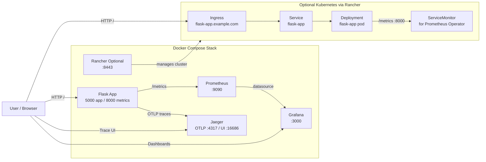
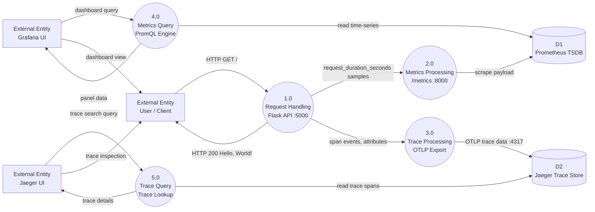

Hello
# py-grafana-docker

## Project Overview
This project encapsulates everything you need to run Grafana in a Docker container effortlessly. It includes a preconfigured setup with various options to customize your Grafana installation.

## Architecture Diagram



### Runtime Flow (Quick View)
- App traffic goes to Flask on port 5000.
- Flask exposes Prometheus metrics on port 8000.
- Flask exports OpenTelemetry traces to Jaeger (OTLP gRPC).
- Prometheus scrapes metrics and Grafana visualizes them.
- Optional Rancher/Kubernetes path uses Ingress, Service, Deployment, and ServiceMonitor.

## Data Flow Diagram



DFD notation used: External Entity (rectangle), Process (circle), Data Store (open-ended store).

## Table of Contents
- [Requirements](#requirements)
- [Installation](#installation)
- [Usage](#usage)
- [Configuration](#configuration)
- [Contributing](#contributing)
- [License](#license)

## Requirements
- Docker
- Docker Compose (if using docker-compose.yml)

## Installation
1. Clone the repository:
   ```bash
   git clone https://github.com/rkdevops04/py-grafana-docker.git
   cd py-grafana-docker
   ```
2. Build the Docker image:
   ```bash
   docker-compose build
   ```

## Usage
- To run the application:
  ```bash
  docker-compose up
  ```
- Access Grafana:
  Open your browser and go to `http://localhost:3000`

## Testing
- Install dependencies and run tests:
  ```bash
  pip install -r requirements.txt
  pytest
  ```

## Jenkins CI/CD Pipeline
This repository now includes a Declarative Pipeline at `Jenkinsfile` with the requested stage flow:

- `checkout scm`
- `git checkout`
- `pre-flight`
- `run pipeline`
- `prepare`
- `validate`
- `build`
- `unit tests`
- `sonar qualityGate`
- `parallel scurtiy scans`
- `blackduck scan`
- `veracode scan`
- `package`
- `sysdig`
- `publish`
- `tag artifact`
- `verfication`
- `docker build`
- `publish docker image`
- `declarative post actions`

### Jenkins Prerequisites
- Jenkins plugins:
  - Pipeline
  - Git
  - JUnit
  - SonarQube Scanner for Jenkins (for `sonar qualityGate`)
  - Docker Pipeline (optional but recommended)
- Build agent tools:
  - `python3`, `pip3`, `docker`
  - `sonar-scanner` (if Sonar stage is enabled)
  - `curl` (for Black Duck Detect bootstrap)
  - `java` + Veracode Pipeline Scan jar (for Veracode stage)
  - `sysdig-cli-scanner` (for Sysdig stage)

### Suggested Jenkins Credentials
- `docker-registry-creds` (Username/Password)
- `blackduck-api-token` (Secret text)
- `veracode-api-id` (Secret text)
- `veracode-api-key` (Secret text)
- `sysdig-secure-api-token` (Secret text)

### Notes
- Sonar stage is parameter-driven (`RUN_SONAR`) so the pipeline can run in environments without Sonar.
- Security scan stages are included and parameter-driven (`RUN_BLACKDUCK`, `RUN_VERACODE`, `RUN_SYSDIG`).
- Scan commands are now wired with standard CLIs:
  - Black Duck Detect uses `BLACKDUCK_URL` + `blackduck-api-token`.
  - Veracode uses `VERACODE_SCAN_JAR` + (`veracode-api-id`, `veracode-api-key`).
  - Sysdig source scan uses `SYSDIG_API_URL` + `sysdig-secure-api-token`.
- Docker publish is controlled by `PUBLISH_DOCKER_IMAGE`.

## Rancher (Kubernetes): App, Metrics, and Logs

This repo includes Kubernetes manifests under `k8s/` for running the Flask app in a Rancher-managed cluster.

### 1. Build and push image
Update the image in `k8s/flask-app.yaml` to your registry tag (example: `docker.io/<user>/flask-app:latest`) and push it:

```bash
docker build -t docker.io/<user>/flask-app:latest .
docker push docker.io/<user>/flask-app:latest
```

### 2. Deploy to Kubernetes

```bash
kubectl apply -k k8s
```

If Rancher Monitoring (Prometheus Operator) is installed, also apply:

```bash
kubectl apply -k k8s/monitoring
```

Set your public DNS host in `k8s/ingress.yaml` (`flask-app.example.com`) and adjust `ingressClassName` if your cluster uses a class other than `nginx`.

### 3. Verify app

```bash
kubectl -n observability-demo get pods,svc
kubectl -n observability-demo port-forward svc/flask-app 5000:5000 8000:8000
```

Then open:
- `http://127.0.0.1:5000/`
- `http://127.0.0.1:8000/metrics`

If Ingress is configured and DNS points to your ingress controller, open:
- `http://flask-app.example.com/`

### 4. View logs in Rancher
- In Rancher UI: `Cluster` -> `Projects/Namespaces` -> `observability-demo` -> `Workloads` -> `flask-app` -> `Pod` -> `Logs`.
- CLI alternative:

```bash
kubectl -n observability-demo logs deploy/flask-app -f
```

### 5. View metrics in Rancher
- In Rancher UI: `Cluster` -> `Monitoring` -> `Explore` (or Grafana) and query:
  - `request_duration_seconds_count`
  - `request_duration_seconds_sum`
  - `up{namespace="observability-demo"}`
- If metrics are missing, confirm scrape target health in Prometheus and verify `Service` annotations / `ServiceMonitor` were applied.

## Configuration
- Customize the `docker-compose.yml` file to set up different databases, Grafana settings, and more.

## Contributing
We welcome contributions! Please fork the repo and submit a pull request.

## License
This project is licensed under the MIT License. See the LICENSE file for details.

## Contact
For additional questions or support, please reach out to rkdevops04.

## Quick Start Guide
- See `PROJECT_GUIDE.md` for all URLs, credentials, Prometheus queries, Jaeger search steps, and project learning outcomes.
